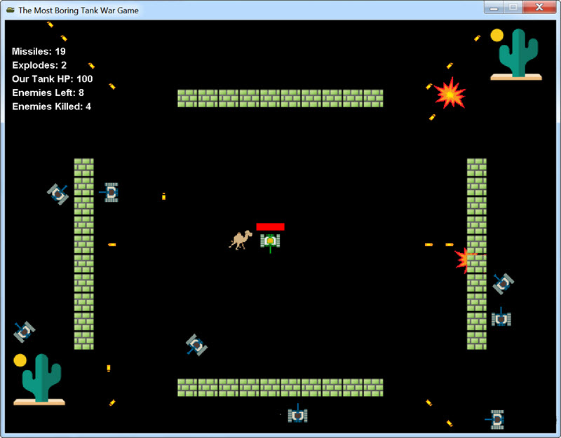
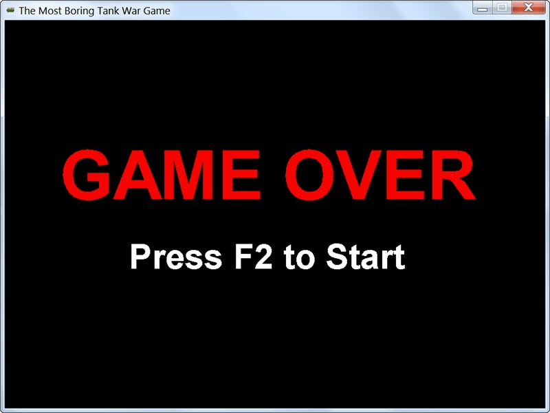

# Tank War
[](https://travis-ci.com/blendid3/TankWar)
[](https://scrutinizer-ci.com/g/blendid3/TankWar/?branch=master)
[](https://scrutinizer-ci.com/g/blendid3/TankWar/build-status/master)


This the small Project of Tank War using knowledge with J2EE, Java OOP, Java AWT, JavaFX, OOP, FAstJSON, JUnit, Maven.
It implemented the basic function of Tank Game: Fire, Move in eight direction, Game savings, Blood showing, Game over and Restart, Home page, etc. 


### Development Environment

It's recommended to use JDK8 or higher version to compiler the project. The recommandation IDE tools is Intellij IDEA. The project use Maven to build and manage the dependence. 

### Player Tank & Keyboard Control

We use UP, Down, Left, Right to control the direction moving and CTRL + SPACE and CTRL + SHIFT to fire and super fire.


### Enemy Tanks
* There will be 12 enemy tanks in the beginning, the images are same with player tank,
but without blood bar
* Enemy tanks will move and fire randomly. Fire sound effect same as player tank. Enemy
tank will not trigger SUPER-FIRE forever, or it will be too difficult for you to survive
* If enemy tank was hit by a missile fired from player tank, it dies immediately and would
disappear from the screen
* If enemy tank fire a missile and hit player tank, it will reduce 20HP from player tank
* If all enemy tanks were dead, reproduce 12 enemy tanks again so that game can continue

### Explosion
* If a missile from player tank hit any enemy tank, or a missile from any enemy tank hit
player tank, please simulate a explosion
* There are 10 images file for you to simulate a simple animation effect under directory
`assets/images`, from `0.gif` to `10.gif`
* Explosion sound effect audio file `assets/audios/explode.wav`

### Wall
* Simulate 4 walls, one in upper-middle, two in left and right, one in bottom-middle
* Use `assets/images/brick.png` to build the walls
* Tank cannot penetrate wall, as it should be
* If missile hit wall, it simply disappears

### Blood
* In the beginning of the game there will be a blood jumping in the center. If player tank
eats the blood its HP will be restored to 100 immediately! Play audio file `assets/audios/revive.wav`
when this happens
* If blood was eaten it will disappear
* If player tank HP was lower than 50%, blood will appear again so that player tank can be
healed completely, however, blood will appear with a chance of 66.7%

### Optional(It's up to you)
* Place two tress in the upper-right and bottom-left using `assets/images/tree.png`
* Fighting against enemies forever can be lonely and boring, a small camel pet might make you
a little bit happier: `assets/images/pet-camel.gif`
* You can search some cute audio files for your pet at here if you want: https://freesound.org/

### Game Rule
* Press SPACE to start game, before that all game objects should stay still
* Tank will move with speed of 5, which means its x and y will either plus or minus 5
* Missile will fly with speed of 10, which means its x and y will either plus of minus 10
* When player tank and enemy tank move and meet, they cannot penetrate each other as it should be
* If HP of player tank was lower or equal to 0, GAME OVER! You should end the game, play the
`assets/audios/death.mp3` audio file as an indicator and print message in the screen like this:
>     GAME OVER
>     PRESS F2 TO RESTART

You may refer to this screenshot as an example:


* After user press F2 game will restart with initial settings
* Display these data in the left-upper side, for example:
```
Missiles: 50
Explodes: 10
Our Tank HP: 80
Enemies Left: 8
Enemies Killed: 452
```

### Implementation Tips
* Design classes of `Tank`, `Missile`, `Wall`, `Blood`, and `Explosion`
* You can simply using `#fillRect` to draw walls with gray color, just calculate their locations
* To detect object collision, you can using `Rectange#intersects`, you can define a method `getRectangle`
for game objects for simple collision detection
* Write a enum `Direction` with 8 directions there(provided in skeleton code)
* Write a game client `TankWar`, with 800 * 600 screen, title and icon(image file provided `assets/images/icon.png`)
* Using a infinite loop to repaint the screen with interval of 50MS
* Change location of tank, missile, explode and implement draw method within these classes
* Develop step by step, write a little and test it soon, use Version Control to manage your
development stage and for easy roll back also
* For your convenience, `Tools.java` and a initial `TankWar.java` as game client was provided.
Basic methods like generate random number, play audio file and etc are there already. The general
idea to draw game objects are also included. However, you still need many work to achieve the goal
we set, feel free to modify the code, as they are just a very rough start and even would have issues
or bad smells. Take care!
* Read javadoc or browse the source code when you get stuck, ask help when you get stuck more than
one hour, as this mid-term project is somewhat challenging for beginners

